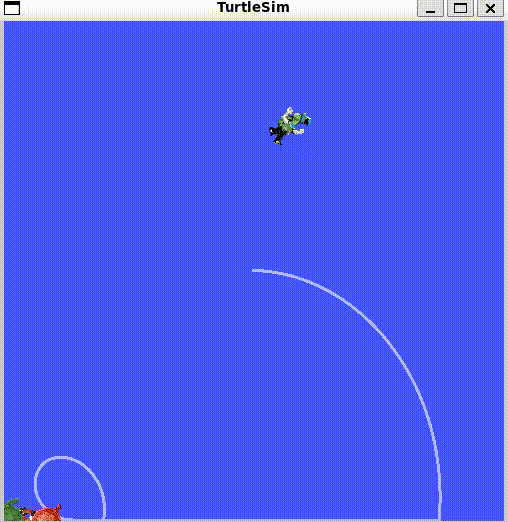

# Robotics Projects

This workspace contains a few robotics projects that reflect my learning journey in ROS 2, Gazebo, navigation, localization, and control:

## turtlesim_catch_game
A playful ROS 2 simulation project built around the turtlesim environment, where the goal is to catch and interact with turtles in a simple game-style setup.

## AGV_Robot_ARM
An AGV robot arm project focused on robot description, bringup, and simulation for a mobile robotic arm system.

