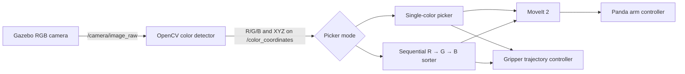

# Panda Vision-Based Color Sorting

A ROS 2 Jazzy simulation in which a Franka Emika Panda robot detects red,
green, and blue boxes with an RGB camera, picks them with MoveIt 2, and drops
each box into its matching open-top container.

The project supports two operating modes:

- Pick one selected color (`R`, `G`, or `B`).
- Sort all boxes automatically in red → green → blue order.

It combines Gazebo Sim, `gz_ros2_control`, MoveIt 2, RViz, OpenCV, TF2, and a
Python MoveIt interface in one workspace.

## Demo


## Current simulation environment

The default world is
[`pick_and_place_world.sdf`](./src/panda_description/worlds/pick_and_place_world.sdf).
It contains:

- A Panda robot mounted on a table.
- Six gap-free designer tables in a 3 × 2 workcell layout.
- Red, green, and blue dynamic boxes with different dimensions.
- Three matching open-top storage containers with 30% transparency.
- A fixed RGB camera above the work area.


## System flow



## Packages

| Package | Purpose |
| --- | --- |
| `panda_description` | Panda URDF/Xacro, meshes, camera, Gazebo models, custom tables, containers, and world |
| `panda_controller` | Arm and gripper `ros2_control` configuration and controller launch files |
| `panda_moveit` | MoveIt 2 planning configuration, `move_group`, and RViz setup |
| `panda_vision` | HSV detection for red, green, and blue plus camera-to-`panda_link0` coordinate conversion |
| `panda_bringup` | Combined Gazebo, controller, MoveIt, RViz, and vision launch file |
| `pymoveit2` | Python MoveIt interface, single-color picker, and sequential color sorter |

## Requirements

This project is developed for:

- Ubuntu 24.04
- ROS 2 Jazzy
- Gazebo Sim with the ROS-Gazebo bridge
- MoveIt 2
- `ros2_control`, `gz_ros2_control`, and the ROS 2 controller packages
- OpenCV, `cv_bridge`, NumPy, and `tf_transformations`
- `colcon` and `rosdep`

Using the ROS 2 Jazzy desktop installation and letting `rosdep` install package
dependencies is recommended.

## Clone and build

The GitHub repository contains this project in the `panda_pick_and_place`
directory:

```bash
git clone https://github.com/xiaohangliuai/Robotics_ROS2_Gazebo_Projects.git
cd Robotics_ROS2_Gazebo_Projects/panda_pick_and_place
```

Install dependencies and build the workspace:

```bash
source /opt/ros/jazzy/setup.bash
rosdep update
rosdep install --from-paths src --ignore-src -r -y
colcon build --symlink-install
source install/setup.bash
```

Source ROS 2 and this workspace in every new terminal:

```bash
cd /path/to/Robotics_ROS2_Gazebo_Projects/panda_pick_and_place
source /opt/ros/jazzy/setup.bash
source install/setup.bash
```

Replace `/path/to/Robotics_ROS2_Gazebo_Projects` with the location where the
repository was cloned.

## Launch the simulation

Start Gazebo, the Panda robot, both controllers, MoveIt/RViz, the camera bridge,
and the color detector:

```bash
cd /path/to/Robotics_ROS2_Gazebo_Projects/panda_pick_and_place
source /opt/ros/jazzy/setup.bash
source install/setup.bash
ros2 launch panda_bringup pick_and_place.launch.py
```

Wait until Gazebo has loaded and the arm and gripper controllers are active
before starting a picker. The launch file intentionally does not start a
picker automatically.

## Option 1: Pick one color

In a second sourced terminal, run one of the following commands:

```bash
# Red box → red container
ros2 run pymoveit2 pick_and_place.py --ros-args -p target_color:=R

# Green box → green container
ros2 run pymoveit2 pick_and_place.py --ros-args -p target_color:=G

# Blue box → blue container
ros2 run pymoveit2 pick_and_place.py --ros-args -p target_color:=B
```

The node waits for the selected color on `/color_coordinates`, locks the first
valid position, performs one pick-and-place cycle, and exits.

### Single-color parameters

| Parameter | Default | Meaning |
| --- | ---: | --- |
| `target_color` | `R` | Box and matching container: `R`, `G`, or `B` |
| `pick_hover_height` | `0.50` m | Hand height above the box before descent and after lifting |
| `grasp_height` | Color-specific | Hand height while closing the fingers |
| `container_approach_height` | `0.45` m | Hand height above the destination container |
| `container_release_height` | `0.25` m | Hand height used to release the box inside the container |

Default grasp heights are `0.140 m` for red, `0.125 m` for green, and
`0.150 m` for blue. A value can be tuned from the command line if necessary:

```bash
ros2 run pymoveit2 pick_and_place.py --ros-args \
  -p target_color:=G \
  -p grasp_height:=0.125
```

## Option 2: Sort all colors automatically

To pick red first, then green, then blue, run:

```bash
ros2 run pymoveit2 pick_all.py
```

The sequential sorter first locks the initial coordinates of all three boxes.
It then runs these steps:

1. Red box → red container.
2. Green box → green container.
3. Blue box → blue container.

It returns the arm to its start configuration after every box and stops the
sequence if MoveIt reports a failed motion. Do not run `pick_all.py` and
`pick_and_place.py` at the same time.

## Vision and coordinate handling

The detector in
[`color_detector.py`](./src/panda_vision/panda_vision/color_detector.py):

1. Converts `/camera/image_raw` from ROS format to OpenCV BGR.
2. Converts each image to HSV.
3. Builds red, green, and blue masks and removes isolated noise.
4. Uses the largest valid contour for each color.
5. Estimates the box position and transforms it into `panda_link0` with TF2.
6. Applies simulation-specific per-color calibration.
7. Publishes a `std_msgs/String` on `/color_coordinates`.

Messages use this comma-separated format:

```text
COLOR_ID,X,Y,Z
```

With the boxes in their default positions, the output should be approximately:

```text
R,0.600,0.350,1.100
G,0.600,0.050,1.100
B,0.600,-0.250,1.100
```

The detected X and Y values locate the box on the table. The picker uses a
known color-specific grasp height instead of the detector's approximate Z
value, because the simulated camera currently uses an assumed depth.

## Motion sequence

For each box, the picker:

1. Moves to a home joint configuration.
2. Moves above the detected box.
3. Opens the gripper.
4. Descends vertically to the color-specific grasp height.
5. Closes the gripper and lifts the box.
6. Returns through the home configuration.
7. Moves above the matching open-top container.
8. Descends, releases the box, and retreats vertically.
9. Returns to the start configuration.

Container centers are defined in `panda_link0`:

| Color | X (m) | Y (m) |
| --- | ---: | ---: |
| Red | `-0.56` | `0.35` |
| Green | `-0.56` | `0.05` |
| Blue | `-0.56` | `-0.25` |

## Important topics and controllers

| Name | Type / role |
| --- | --- |
| `/camera/image_raw` | RGB image from Gazebo through `ros_gz_image` |
| `/camera/camera_info` | Camera calibration information through `ros_gz_bridge` |
| `/color_coordinates` | Detected color and calibrated coordinates |
| `/robot_description` | Panda URDF used by robot state publisher and controllers |
| `/joint_states` | Current Panda arm and gripper joint states |
| `/gripper_controller/joint_trajectory` | Direct gripper open/close trajectory commands |
| `move_group` | MoveIt planning and arm trajectory execution |

## Project layout

```text
panda_pick_and_place/
├── README.md
├── src/
│   ├── panda_bringup/
│   ├── panda_controller/
│   ├── panda_description/
│   │   ├── models/
│   │   ├── urdf/
│   │   └── worlds/pick_and_place_world.sdf
│   ├── panda_moveit/
│   ├── panda_vision/
│   │   └── panda_vision/color_detector.py
│   └── pymoveit2/
│       └── examples/
│           ├── pick_and_place.py
│           └── pick_all.py
├── build/                 # generated by colcon
├── install/               # generated by colcon
└── log/                   # generated by colcon
```

## Customization guide

- Change box, table, container, or world poses in
  `src/panda_description/worlds/pick_and_place_world.sdf`.
- Change container geometry or transparency in
  `src/panda_description/models/sorting_container*/model.sdf`.
- Tune HSV ranges and per-color camera calibration in
  `src/panda_vision/panda_vision/color_detector.py`.
- Tune container centers, grasp heights, and arm poses in
  `src/pymoveit2/examples/pick_and_place.py`.
- Change the automatic order in `PICK_ORDER` inside
  `src/pymoveit2/examples/pick_all.py`.
- Change MoveIt or RViz startup behavior in
  `src/panda_moveit/launch/moveit_launch.py`.

Rebuild after modifying the source. Restart Gazebo completely after changing
the SDF world or model geometry so the new entities are loaded.

## Testing

Run the workspace tests with:

```bash
colcon test --packages-select panda_description panda_vision pymoveit2 panda_bringup
colcon test-result --verbose
```

## Troubleshooting

- **Package or executable not found:** source `/opt/ros/jazzy/setup.bash` and
  `install/setup.bash` in that terminal, then rebuild if the executable is new.
- **MoveIt reports that no motion is in progress:** wait for `move_group` and
  the arm controller to finish starting before launching a picker.
- **Robot does not move:** confirm the arm and gripper controllers are active
  with `ros2 control list_controllers`.
- **No color is detected:** check `ros2 topic hz /camera/image_raw` and
  `ros2 topic echo /color_coordinates`.
- **Gripper is horizontally misaligned:** compare `/color_coordinates` with the
  expected coordinates above, then check the per-color calibration offsets.
- **Gripper is too high or low:** override `grasp_height` for a single-color run
  and update `DEFAULT_GRASP_HEIGHTS` after finding the correct value.
- **OpenCV window does not appear:** the detector needs access to a graphical
  desktop through the `DISPLAY` environment.
- **Old world is still visible:** stop Gazebo, rebuild and source the workspace,
  then launch it again.
- **Unexpected simultaneous motion:** ensure only one picker process is running.
